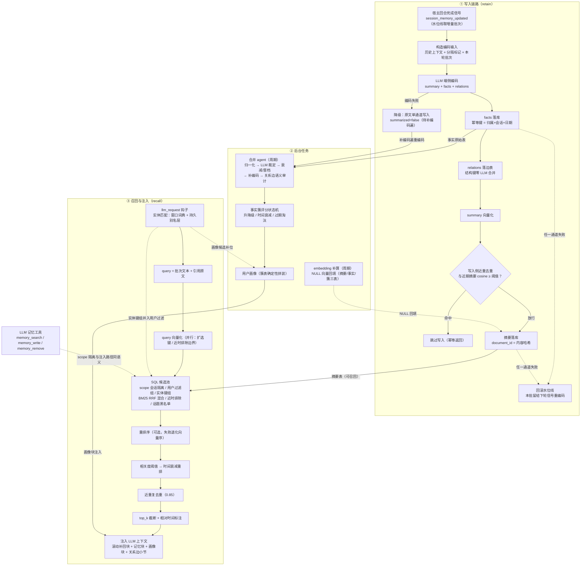

# kira-ai-plugin-noriflow-memory

NoriFlow 本地长期记忆后端（存储后端二选一：**PostgreSQL + pgvector** 或
**SQLite**，零外部服务）。对话自动写入长期记忆，召回时以向量检索 + 重排序
注入上下文；用户画像由事实簇表确定性拼装；同时提供 LLM 主动记忆工具与
WebUI 可视化维护页。

存储后端由 `storage_backend` 配置选择（`postgres | sqlite | auto`，auto =
配了 dsn 用 postgres，否则 sqlite）；同一套 kernel / 合并 agent / 提示词 /
WebUI 逻辑跑在两个后端上（双后端方案见 `docs/plans/`）。

## 功能

- **自动写入（retain）**：维护每会话滚动行缓存，在每轮对话（含工具循环、
  多段回复）全部发送完成后由核心回合完成信号触发一次，按消息水位线取增量
  批次，把「历史窗口 + 本轮增量 + bot 回复」交由 fast 档 LLM 端侧编码为
  **保真摘要 + 人物事实**（摘要全文不超过 300 字），双通道写入 PG（摘要可召回，事实进入合并 agent；facts 先行、summary 殿后——任一通道失败即上抛并回滚水位线，下轮从零重编码，无半提交残留，内容不丢）；编码失败自动降级为原文单通道并回滚水位线待下轮重编码；DB 熔断
  拒绝期 retain 直接失败并回滚水位线（本批留给下轮信号重编码，不白烧编码
  LLM 与向量化调用；超长故障下受会话滚动行缓存上限约束——每会话最多
  保 30 行待重编码）。事实幂等键粒度 = 归属集合 + 会话 +
  日期——同批重复提取去重，跨会话/跨日逐字复现作为独立证据入库计分。
  写入侧近重去重——retain 编码摘要落库前与同会话最近
  `write_dedup_window` 批摘要比对，cosine ≥ `write_dedup_threshold` 的
  跳过写入（抑制历史上下文泄漏进摘要导致的同事件重复行；窗口限制同会话
  近期，久远相似事件不误杀；查询失败 fail-open 继续写入，
  facts/relations 通道不受影响）；
- **合并 agent**：启动缓冲后先跑一轮，此后周期性对原始事实做四遍扫描
  （归一化 → LLM 四分类裁定 → 衰减/晋档 → 补编码），按评分状态机维护
  事实簇，达阈值自动进入画像；replaced 墓碑簇不复活（重申旧说法转为对
  继任簇打矛盾标记）。画像保留三机制：缺席冻结（衰减/降级仅作用于本周期
  活跃用户）、证据地板（≥4 次确认的簇不因话题不再复现跌出画像，被裁定
  更正/演变的簇豁免）、矛盾标记豁免。
- **自动召回（recall）**：每轮对话前以批次文本为 query 做**向量 + BM25
  双路检索**（候选池 max(rerank_candidates, top_k×4)；rerank 关闭时
  top_k×4，RRF 融合）→ 重排序 → 相关度阈值
  → 时间衰减重排 → 近重复去重 → 截断 top_k；支持「会话隔离」开关
  （仅召回本会话 / 跨会话）。
- **召回质量优化**：
  - 扩选——最近 N 批摘要的参与者并入用户过滤，「问及未在场成员」可命中
    其参与过的同会话摘要；扩展命中在 SQL 侧恒钉死当前会话，
    与会话隔离开关无关（结构性防跨会话泄漏）；
  - 问及他人召回——query 命中实体（窗口词典/持久别名层）的
    (platform, uid) 键组并入主路检索：跨会话开放
    （`summary_recall_session_scoped=false`）时并入主键组（问及者任何
    会话的摘要，含其与 bot 的私聊，均可被召回——隐私口径由此开关决定，
    摘要表无会话类型列，无法按 DM/群细分）；会话隔离时与扩选组同构钉死
    当前会话（仅实体本会话摘要）。注入路径、memory_search 工具与
    planner 兜底三路同语义（`recall_hint_enabled` 总开关）。
  - 近时排除（块数锚定）——宿主 LLM 可见历史窗口按「块」截断
    （max_memory_length，窗口内容不带时间戳），而 retain 每轮恰好一批
    摘要，故「最近 K 批摘要」即「窗口内已可见内容」的等价物，这些行
    不参与召回（不占召回名额；K 活读宿主配置，热改即时生效）；
  - 近重复去重——最终序贪心扫描，与已保留条目 embedding cosine ≥
    `dedup_similarity_threshold` 的丢弃（相邻轮次摘要高度重叠，
    不去重时 top_k 会被同一事件的连续快照占满）；
  - 相对时间标注——注入记忆尾部追加（今天/昨天/N天前/约N个月前），
    时区链 = 插件 `timezone` > 宿主 `locale.TZ` > 服务器本地；
  - recall_log——评估日志开关，启用后每次检索/注入各落一条 JSONL
    （query/候选数/各过滤器丢弃数/最终注入集），供离线质量度量。
- **混合检索**：写入侧 bigram 预分词列（search_text）
  + tsvector GIN，与向量路 RRF 融合候选池——稀有条目（人名/游戏名/黑话）
  经 BM25 路进入；存量行由补算任务新增分词回填遍周期补齐；
- **滚动补回**：llm_request 时注入最近 N 批滚动出宿主可见窗口的同会话
  摘要（跳过窗口内 K 批，与近时排除同源；非 query 驱动，notice 触发的
  回合同样注入）；recall 同轮经行排除跳过这些行防重复注入。
- **用户画像**：簇表确定性拼装（六栏：基本信息/称呼偏好/已知事实/互动偏好/
  近期动态/待定信息），无 LLM 参与，注入内容与表内容逐字一致；群聊支持
  多参与者画像。归属匹配为 owner-only（关系语句以 owner 视角写成，注入
  related 方画像会丢失主语；related 参与方由其视角对其提取的事实覆盖），
  owner OR related 匹配仅用于合并候选检索（防关系簇按归属人分裂）。
- **主动工具**：`memory_search`（主动召回）、`memory_write`（写入记忆）、
  `memory_remove`（删除记忆），可通过配置选择启用哪些；并有 `allowed_users`
  用户白名单与 `allowed_sessions` 会话白名单做**代码级拦截**：按触发用户
  或触发会话匹配，**任一命中即放行**（会话命中 = 该会话内任何成员可调用，
  适合整个群开通）。用户条目支持 user_id 或 `平台:user_id`；会话条目支持
  session_id、`平台:session_id`（覆盖该对端 dm 与 gm）或完整 sid
  `平台:类型:session_id`。两名单均留空 = 全部拒绝（fail-closed）。
  **信任边界**：白名单只约束「谁能触发」；默认开启 `tool_scope_locked`
  作用域锁定（工具钉死为触发会话/触发者，忽略 AI 显式传入的
  session_id/user_id，memory_remove 只能删触发作用域内的行）——关闭该
  开关后显式参数恢复生效，此时群聊白名单命中者可让 AI 检索/写入/删除
  其他用户与其他会话的记忆，请知悉后再关闭。
  `memory_search` 的 session_id 参数为**裸会话 ID**（如群号），非
  `平台:类型:id` 完整格式。
- **维护页**：WebUI 侧边栏「长期记忆」页——概览 KPI、事实簇修正（陈述/
  分数/状态）、原始事实清理、画像预览（所见即注入）、摘要语料修正与删除、
  设置（全部记忆运行参数可视化编辑：dsn 等敏感键掩码显示；保存写入宿主
  插件配置存储并即时热生效，连接池/embedding 客户端等装配期展开字段标注
  「重启生效」，保存后弹窗列出）。
- **Kira 记忆数据迁入**：维护页设置栏一键把 KiraAI 宿主
  的存量记忆无损迁入本插件（设置页「Kira 记忆数据迁入」卡片，弹窗二次确认）：
  - 会话历史（`chat_memory.json`）按批次以「待提炼原文」入摘要表
    （summarized=false），由合并 agent 补编码遍逐步 LLM 提炼为摘要 +
    事实 + 关系边（与管线降级原文同路）；
  - 事实/洞察（TOML 真相源）入原始事实表走归一化遍去重入簇；画像
    `profile.json` 的 name/nickname/aliases 入别名表；`archive/`（已遗忘）
    与技能文件按语义不迁入；
  - **幂等可重跑**：全部写入复用现网管线幂等键（摘要
    `{session_id}-{md5}` / 事实 `fact_document_id` 同式 / 别名唯一键），
    重复执行自动去重不产生重复行；源数据全程只读不改不删；
  - 命名空间自动对齐：KiraAI 会话/实体 ID 的 adapter 前缀即宿主
    platform（如 `seki:dm:10086` → platform=seki + session_id=10086），
    与现网数据同键，召回/画像无缝衔接。

## 工作原理



## 配置

| 键 | 类型 | 默认 | 说明 |
|---|---|---|---|
| enabled | bool | true | 插件总开关 |
| storage_backend | string | auto | 存储后端：postgres \| sqlite \| auto（auto=配置了 dsn 用 postgres，否则 sqlite）；启动期只读，运行中不可切换（切后端=换库，须走迁移工具） |
| sqlite_path | string | 空 | SQLite 库文件路径（sqlite 后端生效）；空 = 插件数据目录/memory.sqlite3 |
| dsn | sensitive | 空 | PostgreSQL 连接串（需 pgvector）；storage_backend=auto 时留空即选 sqlite 后端 |
| enabled_tools | multi_select | 全部 | 提供给 AI 的记忆工具（memory_search/write/remove） |
| allowed_users | list | 空 | 主动工具用户白名单（代码级拦截）：条目为 user_id 或 `平台:user_id`；与 allowed_sessions 任一命中即放行，**两者均留空 = 全部拒绝** |
| allowed_sessions | list | 空 | 主动工具会话白名单：条目为 session_id、`平台:session_id`（覆盖该对端 dm+gm）或完整 sid `平台:类型:session_id`；命中会话内任何成员可调用 |
| pool_min / pool_max | integer | 2 / 8 | 连接池范围 |
| db_command_timeout | integer | 60 | 每条 SQL 执行超时秒数（0=不启用）：防挂起查询占死池槽位饿死记忆子系统 |
| embedding_dims | integer | 1024 | 向量维度：迁移 DDL 固定 vector(1024)，除非手工改表否则必须保持默认（不一致时插件拒绝启动） |
| embedding_model | string | 空 | 覆盖 default_embedding，格式 `provider_id:model_id`（与 WebUI 模型标识一致）；解析失败回退默认并告警 |
| encode_input_max_chars | integer | 30000 | 编码输入字符上限（0=不截断）：超长文本截断保底，防补编码毒丸行 |
| backfill_interval_seconds | float | 300 | 向量补算周期 |
| backfill_batch_size | integer | 64 | 补算单批行数 |
| merge_interval_hours | float | 6 | 合并 agent 周期 |
| merge_batch_size | integer | 200 | 归一化遍单批事实数 |
| candidate_top_k | integer | 20 | 候选簇向量检索 top-K |
| llm_budget_per_cycle | integer | 200 | 每周期 LLM 裁定预算 |
| score_start_high / score_start_medium | integer | 3 / 2 | high / medium 置信事实起步分 |
| score_cap / promote_threshold / demote_threshold | float | 10 / 10 / 3 | 分数封顶 / 进画像阈值 / 降级迟滞下界 |
| decay_factor / decay_interval_days | float / integer | 0.8 / 14 | 每周期衰减系数与周期天数（interval 兼缺席冻结窗口粒度；pending 死亡窗口由 pending_dead_days 独立控制） |
| recent_expire_days / recent_promote_threshold | integer / float | 30 / 4 | 近期维度过期天数与进画像阈值 |
| decay_requires_activity | bool | true | 缺席冻结（衰减/降级仅作用于本周期活跃用户） |
| sticky_evidence_count | integer | 4 | 证据地板阈值（0=禁用；被裁定更正/演变的簇豁免） |
| pending_dead_days | integer | 90 | 待定事实死亡窗口（天）：降级/过期后无新证据超此天数才判 dead，与衰减周期解耦 |
| anchor_profile_size | integer | 5 | 画像锚定条数：每维度注入排序前 N 条豁免衰减与降级，被顶替掉出才恢复自然衰减（0=禁用） |
| recall_top_k | integer | 5 | 召回条数上限 |
| recall_relevance_threshold | float | 0 | 召回相关度阈值（0 不过滤） |
| recall_max_tokens | integer | 2048 | 注入 token 预算（字符近似） |
| recall_time_decay_enabled | bool | false | 召回时间衰减：score × 2^(-年龄/半衰期) 后重排（只改排序不过滤） |
| recall_time_decay_half_life_days | float | 90 | 时间衰减半衰期（天），越小越偏好近期 |
| summary_recall_session_scoped | bool | true | 摘要记忆 recall 是否会话隔离（默认开启：仅召回本会话摘要）；对注入路径与 memory_search 工具同时生效（跨会话开放时，问及他人召回的实体键并入主键组） |
| recall_expansion_enabled | bool | true | 召回扩选（扩展命中恒钉死当前会话） |
| recall_expansion_recent_batches | integer | 20 | 扩选取样批次数 |
| recall_exclude_history_window | bool | true | 近时排除（最近 K 批=宿主窗口块数，K=max_memory_length 活读） |
| recall_hint_enabled | bool | true | 实体命中匹配总开关：窗口词典 + 持久别名层的名字匹配，命中喂画像候选（含私聊提及他人）、关系注入节点匹配与问及他人召回键组（跨会话/会话隔离由 `summary_recall_session_scoped` 管）；不驱动召回候选旁路（引用原文并入 recall query 走主路） |
| alias_enabled | bool | true | 持久实体别名层：memory_entity_alias 表（变体拆分后的历史名字流，每回合批次自动积累，重启不清失）作为窗口词典之后的持久命中来源——提起久未发言/历史改名成员可命中其 uid，喂给召回实体路与画像候选；重名歧义时窗口命中者优先、无背书跳过（确定性优先） |
| alias_variant_cap | int | 8 | 每用户保留的名字变体上限（last_seen 倒序截断，抑制状态播报式名片的变体风暴） |
| alias_stopwords | list | [] | 与常用词撞车的名字（如有人昵称叫『谢谢』），命中也不注入 |
| relation_extract_enabled | bool | false | 关系提取：编码时附加 relations 扩展节，从用户发言提取『A 的姐姐是 B』式三元组，零 LLM 合并落 memory_entity_edge；人-人边单次声明即 active，bot 端点边 pending、双证据才激活 |
| relation_bot_edge_min_evidence | int | 2 | bot 端点边激活证据数（按会话+日期去重计数） |
| relation_inject_enabled | bool | false | 关系注入（与提取分离）：实体命中节点 + 关系词出现在输入（如『小张的姐姐』）时注入『相关人物关系』小节——陈述行主体 + 未提及对端的画像；bot 边需本轮 @bot 或引用 bot 消息才可命中，群聊随口聊天零注入 |
| relation_inject_max_neighbors | int | 2 | 关系注入每节点邻居边上限 |
| relation_inject_max_profiles | int | 2 | 边对端画像人数上限（0=只出陈述行） |
| relation_inject_max_lines | int | 3 | 每轮关系陈述行总上限 |
| relation_label_stopwords | list | [朋友,认识,熟人,网友] | 泛关系词停用：写侧拦截（命中 label 的边不落库、已有边不再刷新）+ 读侧不触发边注入双生效（高频口语词误触发兜底） |
| relation_audit_enabled | bool | false | 关系边语义审计遍（挂合并 agent 周期）：LLM 按 id 水位增量审计 active/pending 边，判定为互动描述/称呼复合词/陈述与端点错位/方向矛盾的边置 superseded（墓碑留 reason 可追溯）；批失败/unsure 顺延，同批连续 3 次失败跳批推水位（全量重审=清空 relation_audit_edge_id kv） |
| relation_audit_batch_size | int | 20 | 语义审计遍单批送审边数（每批一次 LLM 调用；每周期调用次数独立上限） |
| dedup_similarity_threshold | float | 0.85 | 近重复去重阈值（0=关闭） |
| write_dedup_enabled | bool | true | 写入侧近重去重：编码摘要与同会话最近 write_dedup_window 批 cosine ≥ write_dedup_threshold 的跳过写入 |
| write_dedup_window | int | 8 | 写入去重比对窗口（同会话最近批次数） |
| write_dedup_threshold | float | 0.85 | 写入去重阈值（0=关闭） |
| recall_time_label_enabled | bool | true | 相对时间标注 |
| timezone | string | 空 | 时区（空=宿主 locale.TZ > 服务器本地） |
| recall_log_enabled | bool | false | 召回评估日志（JSONL） |
| recall_log_path | string | 空 | 日志路径（空=插件数据目录） |
| hybrid_search_enabled | bool | true | 向量+BM25 混合检索 |
| hybrid_rrf_k | integer | 60 | RRF 融合常数 |
| recent_rollout_enabled | bool | true | 滚动补回（窗口外最近批次摘要注入） |
| recent_rollout_batches | integer | 3 | 滚动补回批次数 |
| recent_rollout_max_chars | integer | 1500 | 滚动补回字符预算 |
| max_persona_profiles | integer | 3 | 群聊单轮画像人数上限 |
| topic_blacklist | list | 空 | 话题黑名单（命中关键词的记忆不注入） |
| rerank_enabled | bool | true | 启用重排序（需 default_rerank） |
| rerank_candidates | integer | 50 | 进入重排序的候选数 |
| failure_threshold | integer | 5 | DB 熔断阈值 |
| recovery_seconds | float | 60 | 熔断恢复时间 |
| tool_scope_locked | bool | true | 工具作用域锁定：忽略 AI 显式传入的 session_id/user_id，钉死为触发会话/触发者；关闭 = 显式参数生效（群聊白名单内可跨用户操作，慎开） |

## 安装与依赖

1. 准备存储（二选一）：
   - **SQLite（默认推荐，零外部服务）**：无需准备，库文件默认落在插件数据
     目录 `memory.sqlite3`（`sqlite_path` 可自定义）。向量检索为 Python 暴力
     余弦（无 sqlite-vec 依赖），个人规模（≤数万条摘要）完全够用；
   - **PostgreSQL（进阶）**：启用 **pgvector** 扩展的实例
     （`CREATE EXTENSION vector;`），建议单独建库；schema 由插件启动时自动
     迁移（migrations/）。
2. 在 KiraAI 模型配置中准备好 `default_fast_llm`（编码/裁定）、
   `default_embedding`（向量化）、`default_rerank`（可选，未配置退化为纯向量序）。
3. 将本目录放入 `data/plugins/`：SQLite 后端启用即用；postgres 后端在 WebUI
   插件配置中填写 dsn（或保持 `storage_backend=auto` 且配置 dsn）。
4. 依赖：`asyncpg`、`aiosqlite`、`json_repair`（插件安装时自动 pip 安装，
   无其他额外依赖）。

> SQLite 后端说明：`pool_min/pool_max/db_command_timeout` 忽略（单连接 +
> WAL）；向量列无固定维度，维度不匹配的存量向量按缺失处理（换 embedding
> 模型无需重建表）；摘要表 ~10⁵ 行级后暴力检索进入数百毫秒，届时再评估
> sqlite-vec 或分片。

启用后插件会**自动禁用内置简单记忆插件**（kira_plugin_simple_memory）——
仅在本地记忆完全就绪后才禁用；如看到降级日志请手动在插件管理中处理，
两套记忆并存会重复注入。

## 本地测试

```bash
python tests/test_noriflow_memory.py        # 全链桩测试（装配/retain/工具/维护 API/回归批）
python tests/test_recall.py                 # 召回链路（去重/扩选/混合检索/滚动补回/实体词典）
python tests/test_alias_store.py            # 持久实体别名层
python tests/test_entity_edge.py            # 实体关系边（提取落库/边注入）
python tests/test_relation_backfill.py      # 存量关系回填 + 关系图谱数据层
python tests/test_config_web.py             # 维护页设置栏（schema/掩码/落盘/热更新）
python tests/test_kira_memory_import.py          # Kira 记忆迁入工具真文件 harness
python tests/test_sqlite_backend.py         # SQLite 后端真库集成（收敛管线/recall/alias/edge/WebUI）
```

测试桩基建（宿主桩/装载器）收敛在 `tests/_harness.py`；主套件
test_noriflow_memory.py 保持自包含。修复类改动直接扩展对应模块的
既有测试文件/TestCase，不再另起回归文件。

## 真机回环验证（部署机）

```bash
python tests/live_check.py
# 或指定配置文件路径
NORIFLOW_MEMORY_CONFIG=/path/to/config.json python tests/live_check.py
```

验证项：配置加载、连接与迁移、摘要写入/清理、画像拼装、维护 API 数据层查询。

## 信息

- 适用平台：KiraAI >= 2.31.0
- 数据存储：PostgreSQL + pgvector（asyncpg 直连）或 SQLite，由 `storage_backend` 配置选择（默认 SQLite）

## 许可证

本项目以 [AGPL-3.0](LICENSE) 协议开源。
