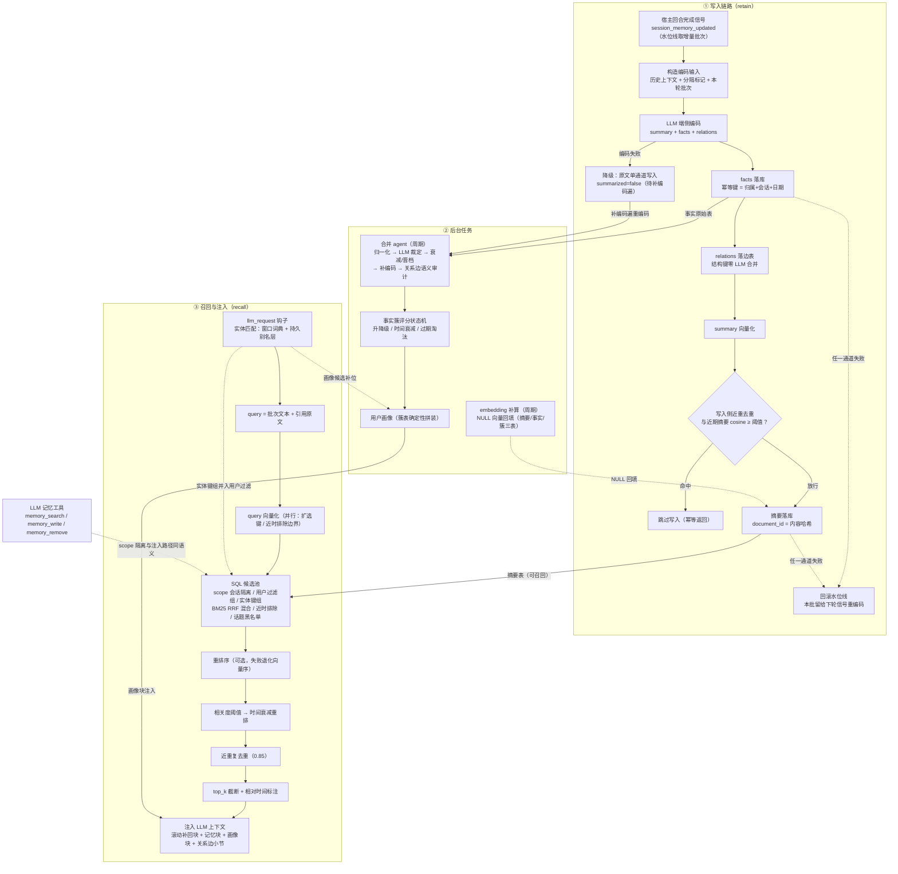

# kira-ai-plugin-noriflow-memory

NoriFlow 本地长期记忆后端（存储后端二选一：**PostgreSQL + pgvector** 或
**SQLite**，零外部服务）。对话自动写入长期记忆，召回时以向量检索 + 重排序
注入上下文；用户画像由事实簇表确定性拼装；同时提供 LLM 主动记忆工具与
WebUI 可视化维护页。

存储后端由 `storage_backend` 配置选择（`postgres | sqlite | auto`，auto =
配了 dsn 用 postgres，否则 sqlite）；同一套 kernel / 合并 agent / 提示词 /
WebUI 逻辑跑在两个后端上（双后端方案见 `docs/plans/`）。

## 功能简介

- **自动记忆**：聊天自动沉淀为长期记忆——每轮对话结束后，后台自动把对话
  提炼为保真摘要与人物事实入库，全程无需手动操作；
- **智能召回**：每轮对话前自动检索相关历史记忆（向量 + BM25 混合检索 +
  重排序），把「记得的事」连同时间标注注入上下文，bot 自然接得上从前的
  话题；
- **用户画像**：为每位成员自动维护 8 维画像（基本信息 / 称呼偏好 /
  已知事实 / 喜好偏好 / 约定承诺 / 互动偏好 / 近期动态 / 待定信息，
  另附历史名变体的「其他名称」栏），群聊支持多人画像；
- **关系图谱**：从聊天中提取成员间关系（「A 的姐姐是 B」式陈述），话题
  涉及时自动在上下文带出相关人物关系（默认关，配置或维护页开启）；
- **AI 记忆工具**：bot 可主动查证、写入、更正、深查记忆
  （memory_search / write / profile / lookup / correct 等），并注入
  记忆工具准则——查到的记忆当亲历自然叙述，不播报操作过程；
- **记忆新陈代谢**：长期未被召回的记忆自动归档并退出召回范围
  （原文保留、可恢复），被召回的记忆自动续期（默认关，配置或维护页开启）；
- **WebUI 维护页**：KiraAI 侧边栏「长期记忆」页——概览 KPI、事实簇修正、
  摘要语料管理、画像预览（所见即注入）、全部运行参数可视化编辑；
- **存量迁入**：维护页一键把 KiraAI 宿主的存量记忆（会话历史 / 事实 /
  别名）无损迁入，幂等可重跑，源数据只读。

## 特点

- **双后端二选一**：PostgreSQL + pgvector 或 SQLite（零外部服务），同一套
  kernel / 合并 agent / WebUI 跑在两个后端上；个人部署推荐 SQLite，
  启用即用；
- **确定性画像**：画像由事实簇表确定性拼装，无 LLM 参与——注入内容与库中
  内容逐字一致，可审计、可在维护页直接修正；
- **结构性隐私边界**：会话隔离召回、工具作用域锁定（默认钉死触发会话 /
  触发者）、用户 / 会话双白名单（留空全拒，fail-closed）——防跨会话 /
  跨用户泄漏是结构保证，不依赖提示词约定；
- **全链路不丢数据**：编码失败自动降级、写入失败回滚水位线下轮重编码、
  幂等键去重、DB 熔断保护，无半提交残留；
- **召回质量工程**：扩选、问及他人召回、近时排除、近重复去重、时间衰减、
  相对 / 绝对时间标注等十余项可调机制，默认即合理；
- **对齐 nori 生态**：记忆工具语义与 nori 侧五件套同源，生命周期、时间
  标注、关系边等机制持续对齐上游。

## 工作原理


```mermaid
flowchart TD
    subgraph W["① 写入链路（retain）"]
        direction TB
        W1["宿主回合完成信号<br/>session_memory_updated（水位线取增量批次）"]
        W2["构造编码输入<br/>历史上下文 + 分隔标记 + 本轮批次"]
        W3["LLM 端侧编码<br/>summary + facts + relations"]
        W3X["降级：原文单通道写入<br/>summarized=false（待补编码遍）"]
        W4["facts 落库<br/>幂等键 = 归属+会话+日期"]
        W5["relations 落边表<br/>结构键零 LLM 合并"]
        W6["summary 向量化"]
        W7{"写入侧近重去重<br/>与近期摘要 cosine ≥ 阈值？"}
        W8["跳过写入（幂等返回）"]
        W9["摘要落库<br/>document_id = 内容哈希"]
        W10["回滚水位线<br/>本批留给下轮信号重编码"]
        W1 --> W2 --> W3
        W3 -- "编码失败" --> W3X
        W3 --> W4 --> W5 --> W6 --> W7
        W7 -- "命中" --> W8
        W7 -- "放行" --> W9
        W4 -. "任一通道失败" .-> W10
        W9 -. "任一通道失败" .-> W10
    end

    subgraph B["② 后台任务"]
        direction TB
        B1["embedding 补算（周期）<br/>NULL 向量回填（摘要/事实/簇三表）"]
        B2["合并 agent（周期）<br/>归一化 → LLM 裁定 → 衰减/晋档<br/>→ 补编码 → 关系边语义审计"]
        B3["事实簇评分状态机<br/>升降级 / 时间衰减 / 过期淘汰"]
        B4["用户画像（簇表确定性拼装）"]
        B2 --> B3 --> B4
    end

    subgraph R["③ 召回与注入（recall）"]
        direction TB
        R1["llm_request 钩子<br/>实体匹配：窗口词典 + 持久别名层"]
        R2["query = 批次文本 + 引用原文"]
        R3["query 向量化（并行：扩选键 / 近时排除边界）"]
        R4["SQL 候选池<br/>scope 会话隔离 / 用户过滤组 / 实体键组<br/>BM25 RRF 混合 / 近时排除 / 话题黑名单"]
        R5["重排序（可选，失败退化向量序）"]
        R6["相关度阈值 → 时间衰减重排"]
        R7["近重复去重（0.85）"]
        R8["top_k 截断 + 相对时间标注"]
        R9["注入 LLM 上下文<br/>滚动补回块 + 记忆块 + 画像块 + 关系边小节"]
        R1 --> R2 --> R3 --> R4 --> R5 --> R6 --> R7 --> R8 --> R9
    end

    T1["LLM 记忆工具<br/>memory_search / memory_write / memory_remove"]

    W9 -- "摘要表（可召回）" --> R4
    W4 -- "事实原始表" --> B2
    W3X -- "补编码遍重编码" --> B2
    B1 -. "NULL 回填" .-> W9
    R1 -. "实体键组并入用户过滤" .-> R4
    R1 -. "画像候选补位" .-> B4
    B4 -- "画像块注入" --> R9
    T1 -. "scope 隔离与注入路径同语义" .-> R4
```

## 配置

| 键 | 类型 | 默认 | 说明 |
|---|---|---|---|
| enabled | bool | true | 插件总开关 |
| storage_backend | string | auto | 存储后端：postgres \| sqlite \| auto（auto=配置了 dsn 用 postgres，否则 sqlite）；启动期只读，运行中不可切换（切后端=换库，须走迁移工具） |
| sqlite_path | string | 空 | SQLite 库文件路径（sqlite 后端生效）；空 = 插件数据目录/memory.sqlite3 |
| dsn | sensitive | 空 | PostgreSQL 连接串（需 pgvector）；storage_backend=auto 时留空即选 sqlite 后端 |
| enabled_tools | multi_select | 全部 | 提供给 AI 的记忆工具（memory_search/write/remove + memory_profile/lookup/correct） |
| memory_tools_enabled | bool | true | 新三件（profile/lookup/correct）总开关；关闭则不注册（search/write/remove 由 enabled_tools 管理） |
| summary_lifecycle_enabled | bool | false | 摘要生命周期总开关：归档遍（超龄且强化窗口内无召回命中的行置 archived，结构性退出召回；原文保留可恢复） |
| summary_lifecycle_grace_days | integer | 30 | 最低保留期（天）：written_at 距今不足此值永不归档 |
| summary_lifecycle_half_life_days | float | 90 | 生命周期半衰期：归档时限 = 最低保留期 + 3×半衰期 |
| summary_lifecycle_reinforce_window_days | integer | 90 | 访问强化窗口：最近一次被召回命中在窗口内的行豁免归档（一次召回续命一个窗口） |
| summary_lifecycle_interval_days | integer | 7 | 归档遍周期（天）：kv 持久化重启不丢；首遍延后至强化窗口后 |
| summary_lifecycle_reinforce_on_recall | bool | true | 召回访问强化：最终注入集异步刷新 last_recall_at/recall_count（不受总开关门控——预累积信号防首遍误判） |
| allowed_users | list | 空 | 主动工具用户白名单（代码级拦截）：条目为 user_id 或 `平台:user_id`；与 allowed_sessions 任一命中即放行，**两者均留空 = 全部拒绝** |
| allowed_sessions | list | 空 | 主动工具会话白名单：条目为 session_id、`平台:session_id`（覆盖该对端 dm+gm）或完整 sid `平台:类型:session_id`；命中会话内任何成员可调用 |
| pool_min / pool_max | integer | 2 / 8 | 连接池范围 |
| db_command_timeout | integer | 60 | 每条 SQL 执行超时秒数（0=不启用）：防挂起查询占死池槽位饿死记忆子系统 |
| embedding_dims | integer | 1024 | 向量维度：迁移 DDL 固定 vector(1024)，除非手工改表否则必须保持默认（不一致时插件拒绝启动） |
| embedding_model | string | 空 | 覆盖 default_embedding，格式 `provider_id:model_id`（与 WebUI 模型标识一致）；解析失败回退默认并告警 |
| encode_input_max_chars | integer | 30000 | 编码输入字符上限（0=不截断）：超长文本截断保底，防补编码毒丸行 |
| backfill_interval_seconds | float | 300 | 向量补算周期 |
| backfill_batch_size | integer | 64 | 补算单批行数 |
| merge_interval_hours | float | 6 | 合并 agent 周期 |
| merge_batch_size | integer | 200 | 归一化遍单批事实数 |
| candidate_top_k | integer | 20 | 候选簇向量检索 top-K |
| llm_budget_per_cycle | integer | 200 | 每周期 LLM 裁定预算 |
| score_start_high / score_start_medium | integer | 3 / 2 | high / medium 置信事实起步分 |
| score_cap / promote_threshold / demote_threshold | float | 10 / 10 / 3 | 分数封顶 / 进画像阈值 / 降级迟滞下界 |
| decay_factor / decay_interval_days | float / integer | 0.8 / 14 | 每周期衰减系数与周期天数（interval 兼缺席冻结窗口粒度；pending 死亡窗口由 pending_dead_days 独立控制） |
| recent_expire_days / recent_promote_threshold | integer / float | 30 / 4 | 近期维度过期天数与进画像阈值 |
| commitment_expire_days | integer | 60 | 约定维度过期天数：最近一次被确认后超此天数无新证据，降待定出画像（簇体保留可复活；持续被提起的约定自动续期） |
| decay_requires_activity | bool | true | 缺席冻结（衰减/降级仅作用于本周期活跃用户） |
| sticky_evidence_count | integer | 4 | 证据地板阈值（0=禁用；被裁定更正/演变的簇豁免） |
| pending_dead_days | integer | 90 | 待定事实死亡窗口（天）：降级/过期后无新证据超此天数才判 dead，与衰减周期解耦 |
| anchor_profile_size | integer | 5 | 画像锚定条数：每维度注入排序前 N 条豁免衰减与降级，被顶替掉出才恢复自然衰减（0=禁用） |
| recall_top_k | integer | 5 | 召回条数上限 |
| recall_relevance_threshold | float | 0 | 召回相关度阈值（0 不过滤） |
| recall_max_tokens | integer | 2048 | 注入 token 预算（字符近似） |
| recall_time_decay_enabled | bool | false | 召回时间衰减：score × 2^(-年龄/半衰期) 后重排（只改排序不过滤） |
| recall_time_decay_half_life_days | float | 90 | 时间衰减半衰期（天），越小越偏好近期 |
| summary_recall_session_scoped | bool | true | 摘要记忆 recall 是否会话隔离（默认开启：仅召回本会话摘要）；对注入路径与 memory_search 工具同时生效（跨会话开放时，问及他人召回的实体键并入主键组） |
| recall_expansion_enabled | bool | true | 召回扩选（扩展命中恒钉死当前会话） |
| recall_expansion_recent_batches | integer | 20 | 扩选取样批次数 |
| recall_exclude_history_window | bool | true | 近时排除（最近 K 批=宿主窗口块数，K=max_memory_length 活读） |
| recall_hint_enabled | bool | true | 实体命中匹配总开关：窗口词典 + 持久别名层的名字匹配，命中喂画像候选（含私聊提及他人）、关系注入节点匹配与问及他人召回键组（跨会话/会话隔离由 `summary_recall_session_scoped` 管）；不驱动召回候选旁路（引用原文并入 recall query 走主路） |
| alias_enabled | bool | true | 持久实体别名层：memory_entity_alias 表（变体拆分后的历史名字流，每回合批次自动积累，重启不清失）作为窗口词典之后的持久命中来源——提起久未发言/历史改名成员可命中其 uid，喂给召回实体路与画像候选；重名歧义时窗口命中者优先、无背书跳过（确定性优先） |
| alias_variant_cap | int | 8 | 每用户保留的名字变体上限（last_seen 倒序截断，抑制状态播报式名片的变体风暴） |
| alias_stopwords | list | [] | 与常用词撞车的名字（如有人昵称叫『谢谢』），命中也不注入 |
| relation_extract_enabled | bool | false | 关系提取：编码时附加 relations 扩展节，从用户发言提取『A 的姐姐是 B』式三元组，零 LLM 合并落 memory_entity_edge；人-人边单次声明即 active，bot 端点边 pending、双证据才激活 |
| relation_bot_edge_min_evidence | int | 2 | bot 端点边激活证据数（按会话+日期去重计数） |
| relation_inject_enabled | bool | false | 关系注入（与提取分离）：实体命中节点 + 关系词出现在输入（如『小张的姐姐』）时注入『相关人物关系』小节——陈述行主体 + 未提及对端的画像；bot 边需本轮 @bot 或引用 bot 消息才可命中，群聊随口聊天零注入 |
| relation_inject_max_neighbors | int | 2 | 关系注入每节点邻居边上限 |
| relation_inject_max_profiles | int | 2 | 边对端画像人数上限（0=只出陈述行） |
| relation_inject_max_lines | int | 3 | 每轮关系陈述行总上限 |
| relation_label_stopwords | list | [朋友,认识,熟人,网友] | 泛关系词停用：写侧拦截（命中 label 的边不落库、已有边不再刷新）+ 读侧不触发边注入双生效（高频口语词误触发兜底） |
| relation_audit_enabled | bool | false | 关系边语义审计遍（挂合并 agent 周期）：LLM 按 id 水位增量审计 active/pending 边，判定为互动描述/称呼复合词/陈述与端点错位/方向矛盾的边置 superseded（墓碑留 reason 可追溯）；批失败/unsure 顺延，同批连续 3 次失败跳批推水位（全量重审=清空 relation_audit_edge_id kv） |
| relation_audit_batch_size | int | 20 | 语义审计遍单批送审边数（每批一次 LLM 调用；每周期调用次数独立上限） |
| dedup_similarity_threshold | float | 0.85 | 近重复去重阈值（0=关闭） |
| write_dedup_enabled | bool | true | 写入侧近重去重：编码摘要与同会话最近 write_dedup_window 批 cosine ≥ write_dedup_threshold 的跳过写入 |
| write_dedup_window | int | 8 | 写入去重比对窗口（同会话最近批次数） |
| write_dedup_threshold | float | 0.85 | 写入去重阈值（0=关闭） |
| recall_time_label_enabled | bool | true | 时间标注（recall 主路与滚动补回共用，按本地时区换算） |
| recall_time_label_mode | string | both | 标注形态：relative（今天/N天前）/ absolute（9月28日 14:30，跨年带年份）/ both（相对+绝对并列）。绝对部分分层精度：7 天内带时分，更久只到日期 |
| timezone | string | 空 | 时区（空=宿主 locale.TZ > 服务器本地） |
| recall_log_enabled | bool | false | 召回评估日志（JSONL） |
| recall_log_path | string | 空 | 日志路径（空=插件数据目录） |
| hybrid_search_enabled | bool | true | 向量+BM25 混合检索 |
| hybrid_rrf_k | integer | 60 | RRF 融合常数 |
| recent_rollout_enabled | bool | true | 滚动补回（窗口外最近批次摘要注入） |
| recent_rollout_batches | integer | 3 | 滚动补回批次数 |
| recent_rollout_max_chars | integer | 1500 | 滚动补回字符预算 |
| max_persona_profiles | integer | 3 | 群聊单轮画像人数上限 |
| topic_blacklist | list | 空 | 话题黑名单（命中关键词的记忆不注入） |
| rerank_enabled | bool | true | 启用重排序（需 default_rerank） |
| rerank_candidates | integer | 50 | 进入重排序的候选数 |
| failure_threshold | integer | 5 | DB 熔断阈值 |
| recovery_seconds | float | 60 | 熔断恢复时间 |
| tool_scope_locked | bool | true | 工具作用域锁定：忽略 AI 显式传入的 session_id/user_id，钉死为触发会话/触发者；关闭 = 显式参数生效（群聊白名单内可跨用户操作，慎开） |

## 安装与依赖

1. 准备存储（二选一）：
   - **SQLite（默认推荐，零外部服务）**：无需准备，库文件默认落在插件数据
     目录 `memory.sqlite3`（`sqlite_path` 可自定义）。向量检索为 Python 暴力
     余弦（无 sqlite-vec 依赖），个人规模（≤数万条摘要）完全够用；
   - **PostgreSQL（进阶）**：启用 **pgvector** 扩展的实例
     （`CREATE EXTENSION vector;`），建议单独建库；schema 由插件启动时自动
     迁移（migrations/）。
2. 在 KiraAI 模型配置中准备好 `default_fast_llm`（编码/裁定）、
   `default_embedding`（向量化）、`default_rerank`（可选，未配置退化为纯向量序）。
3. 将本目录放入 `data/plugins/`：SQLite 后端启用即用；postgres 后端在 WebUI
   插件配置中填写 dsn（或保持 `storage_backend=auto` 且配置 dsn）。
4. 依赖：`asyncpg`、`aiosqlite`、`json_repair`（插件安装时自动 pip 安装，
   无其他额外依赖）。

> SQLite 后端说明：`pool_min/pool_max/db_command_timeout` 忽略（单连接 +
> WAL）；向量列无固定维度，维度不匹配的存量向量按缺失处理（换 embedding
> 模型无需重建表）；摘要表 ~10⁵ 行级后暴力检索进入数百毫秒，届时再评估
> sqlite-vec 或分片。

启用后插件会**自动禁用内置简单记忆插件**（kira_plugin_simple_memory）——
仅在本地记忆完全就绪后才禁用；如看到降级日志请手动在插件管理中处理，
两套记忆并存会重复注入。

## 本地测试

```bash
python tests/test_noriflow_memory.py        # 全链桩测试（装配/retain/工具/维护 API/回归批）
python tests/test_recall.py                 # 召回链路（去重/扩选/混合检索/滚动补回/实体词典）
python tests/test_alias_store.py            # 持久实体别名层
python tests/test_entity_edge.py            # 实体关系边（提取落库/边注入）
python tests/test_relation_backfill.py      # 存量关系回填 + 关系图谱数据层
python tests/test_config_web.py             # 维护页设置栏（schema/掩码/落盘/热更新）
python tests/test_kira_memory_import.py          # Kira 记忆迁入工具真文件 harness
python tests/test_sqlite_backend.py         # SQLite 后端真库集成（收敛管线/recall/alias/edge/WebUI）
python tests/test_memory_tools_sqlite.py    # 记忆工具五件套 + 生命周期真 SQLite 集成（直写链/状态机/归档判据）
```

测试桩基建（宿主桩/装载器）收敛在 `tests/_harness.py`；主套件
test_noriflow_memory.py 保持自包含。修复类改动直接扩展对应模块的
既有测试文件/TestCase，不再另起回归文件。

## 真机回环验证（部署机）

```bash
python tests/live_check.py
# 或指定配置文件路径
NORIFLOW_MEMORY_CONFIG=/path/to/config.json python tests/live_check.py
```

验证项：配置加载、连接与迁移、摘要写入/清理、画像拼装、维护 API 数据层查询。

## 信息

- 适用平台：KiraAI >= 2.31.0
- 数据存储：PostgreSQL + pgvector（asyncpg 直连）或 SQLite，由 `storage_backend` 配置选择（默认 SQLite）

## 许可证

本项目以 [AGPL-3.0](LICENSE) 协议开源。
